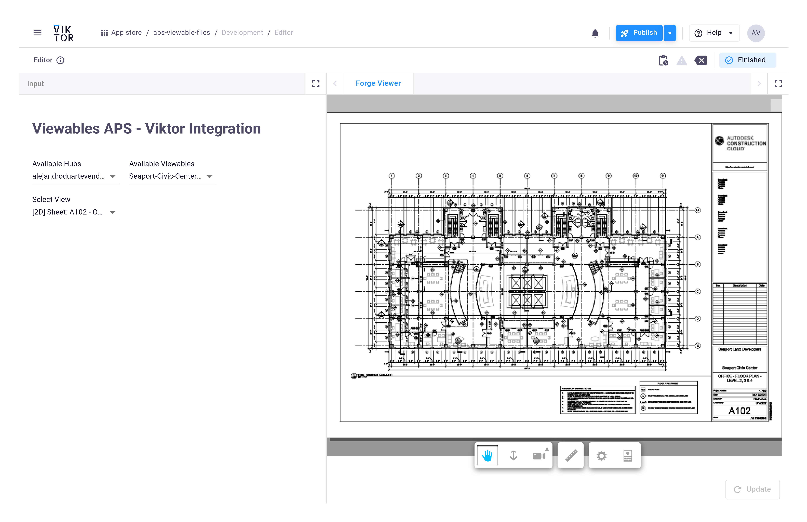
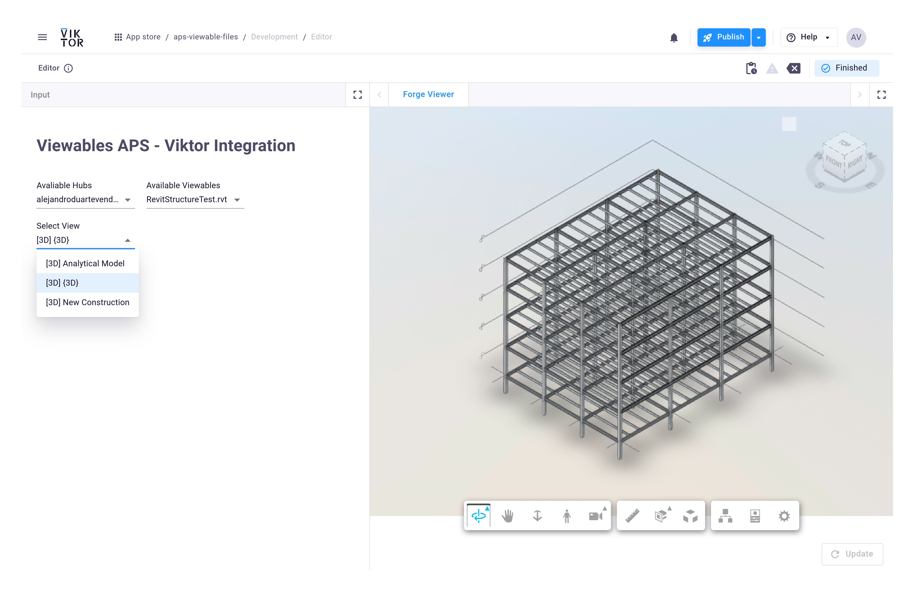

# APS Viewable Files (2D/3D views)

This repo shows how to find the 2D and 3D views for a model and load them in the APS Viewer. We read the Model Derivative manifest to discover the right view GUIDs and pass those to the viewer.

## Screenshots

## Views
- [get_view_options](./app.py): reads the derivative manifest and collects the 2D/3D view GUIDs. This is the reliable approach; the generic list of “viewable objects” won’t load views correctly in the viewer.

## Viewer
- [ViewableViewer.html](./ViewableViewer.html): fill in ACCESS_TOKEN, DOCUMENT_URN (urn:...), and optional TARGET_GUID (a view GUID). If TARGET_GUID is omitted, the viewer loads the default geometry.

## Concurrency
- This app uses threads in [aps_helpers.py](./aps_helpers.py) to speed up retrieval (I/O-bound HTTP). `ThreadPoolExecutor` parallelizes across hubs, top folders, and folder traversal:
	- [get_all_cad_file_from_hub](./aps_helpers.py): submits hub/top-folder work.
	- [get_all_cad_from_folder](./aps_helpers.py): optionally processes subfolders/items in parallel when an executor is provided.

	This fits `requests`-based calls and avoids switching to async.

